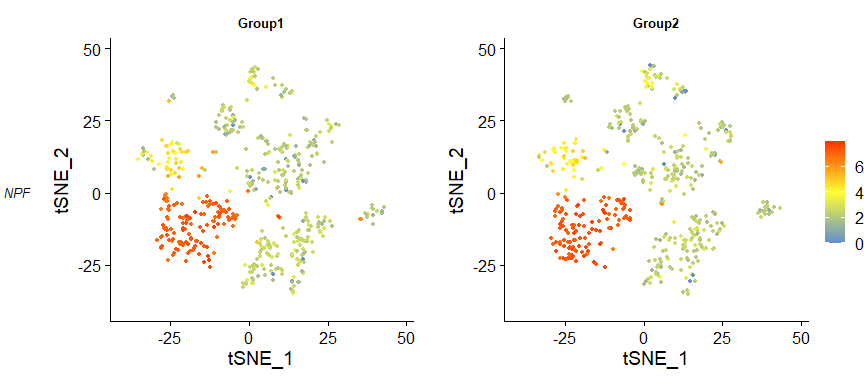
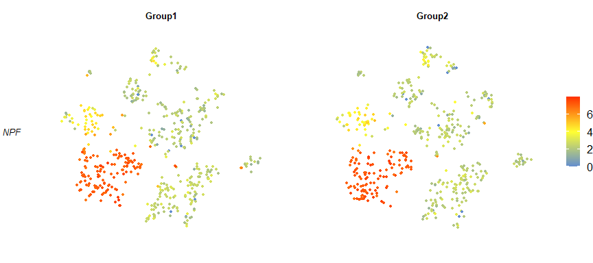
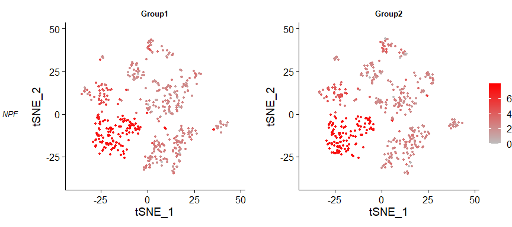

<!-- README.md is generated from README.Rmd. Please edit that file -->

# ZhangRtools

<!-- badges: start -->

[](https://lifecycle.r-lib.org/articles/stages.html#experimental)
<!-- badges: end -->

> 工作中常用到的一些基于R的功能，整理到一起了，方便重复使用。

## 1. 安装

You can install the development version of ZhangRtools from
[GitHub](https://github.com/) with:

``` r
library(devtools)
install_github("fentouxungui/ZhangRtools")
```

## 2. 功能

``` r
library(ZhangRtools)
```

### 2.1 文件内容修改

#### ModifyFile

以逐行读取方式，对文件里的内容进行字符串替换。

``` r
ModifyFile(file = "./scRNAseq/Fly/Ovary/Fly-Ovary-Jevitt-PlosBiology-2020/Parameters.R", #文件路径
           LineMatchKeyWords = c("SplitBy.levels.max","15"), # 关键词向量，用于定位要被修改的行
           LineMatch.ignore.case = FALSE, # 依据关键词定位行时，是否需要忽略关键词的大小写
           WordOld = "SplitBy.levels.max <- 15", # 要被替换的词,一个字符串
           wordold.Matchfixed = TRUE, # 匹配字符串时,是否需要完全匹配，FALSE为使用正则表达式
           WordNew = "SplitBy.levels.max <- 50", # 新词,一个字符串
           Replace = TRUE, # 是否执行替换,一个逻辑值
           SaveOld = TRUE, # 是否要保存旧的文件,一个逻辑值
           silence = FALSE, # 是否屏蔽信息输出,一个逻辑值
           returnSummary = TRUE) # 是否输出替换统计结果,一个逻辑值,主要用于批量替换
```

#### BatchModifyFile

以批量形式，对某个目录下的某类文件进行字符串替换。

``` r
BatchModifyFile(Directory = "./shiny-server/PublicData/scRNAseq", # 目录
                FileNamePattern = "^Parameters.R$", #目录下，所有符合此正则表达式的文件
                LineMatchKeyWords = c("SplitBy.levels.max","15"), # 用于寻找要被修改的行,一个关键词向量
                LineMatch.ignore.case = FALSE, # 依据关键词寻找要被修改的行时,是否需要忽略行关键词的大小写,一个逻辑值
                WordOld = "SplitBy.levels.max <- 15", # 要被替换的词,一个字符串
                WordNew = "SplitBy.levels.max <- 50", # 新词,一个字符串
                Replace = TRUE, # 是否要执行替换,一个逻辑值
                SaveOld = TRUE) # 是否保存旧文件,一个逻辑值
```

**建议，执行批量替换之前，先使用参数`Replace = FALSE`看一下替换是否正确！**

### 2.2 数据框相关

#### Aggregate_df

合并某列的重复值，对其他所有行进行字符串拼接\[**压缩行**\]。压缩时，使用“;
”进行分隔。

``` r
dt <- data.frame(genotype = c("X1", "X2", "X3", "X1", "X2", "X3", "X1", "X2", "X3"),
                  variable = c("A", "A", "A", "B", "B", "B", "C", "C", "C"),
                  value = c(1L, 1L, 2L, 2L, 3L, 3L,  4L, 4L, 5L), stringsAsFactors = FALSE)
dt
#>   genotype variable value
#> 1       X1        A     1
#> 2       X2        A     1
#> 3       X3        A     2
#> 4       X1        B     2
#> 5       X2        B     3
#> 6       X3        B     3
#> 7       X1        C     4
#> 8       X2        C     4
#> 9       X3        C     5
```

``` r
Aggregate_df(df = dt, id = colnames(dt)[1])
#>   genotype variable   value
#> 1       X1  A; B; C 1; 2; 4
#> 2       X2  A; B; C 1; 3; 4
#> 3       X3  A; B; C 2; 3; 5
```

#### Expand_df

对某列进行字符串切割，复制其他所有行\[扩展行\]。

``` r
Expand_df(df, 
          id, # 要被切割的列
          splitby = "/") # 字符串切割时的分隔符
```

#### update_IDs

基于数据库，对ID向量进行转换，返回更新后的向量，其中NA值或空字符串会返回NA值。另外，ID向量里的单个元素可以是多个ID的组合。

``` r
db <- data.frame(old = c("1","2","3"), new = c("A", "B", "C"))

update_IDs(old = c("2","2","1"), # 要被转换的id向量，元素可以是多个id名的组合，用| ；或其它符号隔开。
           db = db, # 注释数据库，包含旧名和新名
           from = "old", # 注释数据库中对应原来ID的列名
           to = "new", # 注释数据库中新ID的列名
           split = NULL,  # 如果ID向量中的元素为多个id组合，需要指定分割符号，默认为NULL，即为单个ID，无需分割
           fixed = TRUE) # 默认TRUE，被strsplit函数继承的参数
#> [1] "B" "B" "A"
```

``` r

update_IDs(old = c("2;2","3","1"), 
           db = db,
           from = "old",
           to = "new", 
           split = ";", 
           fixed = TRUE)
#> [1] "B;B" "C"   "A"
```

常用对数据框里的某一列基因ID进行更新或转换。

#### mapping_update

基于至多3个关键词的数据框更新

依据数据库信息，和至多3种ID，更新数据。返回1个list，包含两个数据框，第一个matched：更新后的数据框，第二个lost，不能被识别的行。注意：该函数值更新了第一个关键词，即by.input列。另外，该函数在后两轮匹配时，会输出重复匹配的条目。

返回一个list，包含两个数据框，第一个matched：更新后的数据框，第二个lost，不能被识别的行.可能的问题：1.
如果两个ensembl id对应同一个HGNC，那么第二轮
用HGNC匹配时，可能仅能匹配到一个Ensebmbl id。同理第三轮匹配也是。

``` r
mapping_update(inputDF = tf.full.database, 
               db = gtf, 
               by.input = "Ensembl.ID", by.db = "Ensembl", 
               by.input.2 = "HGNC.symbol", by.db.2 = "Symbol",
               by.input.3 = "EntrezGene.ID", by.db.3 = "EntrezID")
```

``` r
demo_df1 <- data.frame(A = c("a", "b", "c", "d", "e", "f","g"),
                       B = c("A", "B", "C", "D", "E", "F", "G"),
                       C = c(11, 12, 13, 14, 15, 6, 7))

demo_df2 <- data.frame(a = c("a", "b", "c", "dd", "ee", "ff", "h"),
                       b = c("A", "BB", "C", "D", "E", "FF", "H"),
                       c = c(21, 22, 23, 24, 25, 6, 77))

mapping_update(inputDF = demo_df1, 
               db = demo_df2, 
               by.input = "A", by.db = "a", 
               by.input.2 = "B", by.db.2 = "b",
               by.input.3 = "C", by.db.3 = "c")
#> 1. 依据input里的A列和数据库里的a列进行数据比对:
#> 4行未被对应上。
#> 2. 依据input里的B列和数据库里的b列对未匹配的数据再次进行比对:
#> 请手动检查以下替换是否正确！
#> 替换前：
#>   A B  C
#> 4 d D 14
#> 5 e E 15
#> 替换后：
#>    A B  C
#> 4 dd D 14
#> 5 ee E 15
#> 2行未被对应上。
#> 3. 依据input里的C列和数据库里的c列对未匹配的数据再次进行比对:
#> 请手动检查以下替换是否正确！
#> 替换前：
#>   A B C
#> 6 f F 6
#> 替换后：
#>    A B C
#> 6 ff F 6
#> 1行未被对应上。
#> $matched
#>    A B  C  label
#> 1  a A 11  First
#> 2  b B 12  First
#> 3  c C 13  First
#> 4 dd D 14 Second
#> 5 ee E 15 Second
#> 6 ff F  6  Third
#> 
#> $lost
#>   A B C
#> 7 g G 7
```

#### mapping_join

基于至多3对关键词，合并两个数据框

与mapping_update的区别，mapping_join不会修改原来的数据，只是在原来数据的基础上，添加新数据到新的列中。

返回1个list，包含两个数据框，第一个matched：合并后的数据框，第二个lost，不能被识别的行。

注意：该函数的第一个关键词，即by.input列，应为绝大多数能被匹配上的。关键词可以重复使用，每次的关键词对不同即可。另外，该函数在后两轮匹配时，会输出重复匹配的条目。

关键词匹配是有优先顺序的，第一次被匹配上了，后续就不会再去做匹配。

``` r
mapping_join(inputDF = tf.full.database, 
               db = gtf, 
               by.input = "Ensembl.ID", by.db = "Ensembl", 
               by.input.2 = "HGNC.symbol", by.db.2 = "Symbol",
               by.input.3 = "EntrezGene.ID", by.db.3 = "EntrezID")
```

``` r
mapping_join(inputDF = demo_df1, 
               db = demo_df2, 
               by.input = "A", by.db = "a", 
               by.input.2 = "B", by.db.2 = "b",
               by.input.3 = "C", by.db.3 = "c")
#> 1. 依据input里的A列和数据库里的a列进行数据比对:
#> 4行未被对应上。
#> 2. 依据input里的B列和数据库里的b列对未匹配的数据再次进行比对:
#> 请手动检查以下替换是否正确！
#> 替换前：
#>   A B  C
#> 4 d D 14
#> 5 e E 15
#> 替换后：
#>   A B  C
#> 4 d D 14
#> 5 e E 15
#> 2行未被对应上。
#> 3. 依据input里的C列和数据库里的c列对未匹配的数据再次进行比对:
#> 请手动检查以下替换是否正确！
#> 替换前：
#>   A B C
#> 6 f F 6
#> 替换后：
#>   A B C
#> 6 f F 6
#> 1行未被对应上。
#> $matched
#>   A B  C  a  b  c      label
#> 1 a A 11  a  A 21  First_A_a
#> 2 b B 12  b BB 22  First_A_a
#> 3 c C 13  c  C 23  First_A_a
#> 4 d D 14 dd  D 24 Second_A_a
#> 5 e E 15 ee  E 25 Second_A_a
#> 6 f F  6 ff FF  6  Third_A_a
#> 
#> $lost
#>   A B C
#> 7 g G 7
```

### 2.3 HGNC 数据库相关的

#### Check_hgnc_hits

修正HGNC的Multi-symbol checker工具的输出结果

HGNC 提供的[Multi-symbol
checker在线工具](https://www.genenames.org/tools/multi-symbol-checker/)可以将基因名更新到最新,但是会输出所有匹配的结果,也就是说单个input
gene可能会有多个hits.此工具可保留主要匹配结果,去除可能的错误hits以及未必对上的input.

``` r
Check_hgnc_hits(hgnc.hits)
```

### 2.4 scRNAseq 相关的

#### top_genes

对Seurat
Object里的各个单细胞，分别统计top表达的基因，即基因的reads比例大于所设定的阈值expt.cut，并将结果汇总到一起。返回Top表达的基因，包括细胞数目、平均值和中位值信息。

``` r
top_genes(SeuratObj, 
          expr.cut = 0.01) # 针对UMI counts比例所设定的cut off，用于定义高表达的基因。
```

#### modified FeaturePlot

``` r
library(SeuratExplorerServer)
rds.file <- paste(c(system.file(package ="SeuratExplorerServer"), "extdata/demo/fly-gut-EEs-scRNA/Rds-file/G101_PC20res04.rds"), collapse = "/")
cds <- readRDS(rds.file)
cds
#> An object of class Seurat 
#> 9319 features across 1000 samples within 1 assay 
#> Active assay: RNA (9319 features, 737 variable features)
#>  3 layers present: counts, data, scale.data
#>  2 dimensional reductions calculated: pca, tsne
```

``` r
FeaturePlot_Single(cds, feature = 'NPF', SplitBy = 'RandomGroup',remove_axes = FALSE)
#> 载入需要的程序包：ggplot2
#> 载入需要的程序包：SeuratObject
#> 载入需要的程序包：sp
#> 
#> 载入程序包：'SeuratObject'
#> The following objects are masked from 'package:base':
#> 
#>     intersect, t
#> Scale for colour is already present.
#> Adding another scale for colour, which will replace the existing scale.
#> Scale for colour is already present.
#> Adding another scale for colour, which will replace the existing scale.
#> Scale for x is already present.
#> Adding another scale for x, which will replace the existing scale.
#> Scale for y is already present.
#> Adding another scale for y, which will replace the existing scale.
#> Scale for x is already present.
#> Adding another scale for x, which will replace the existing scale.
#> Scale for y is already present.
#> Adding another scale for y, which will replace the existing scale.
```



``` r
FeaturePlot_Single(cds, feature = 'NPF', SplitBy = 'RandomGroup',remove_axes = TRUE)
#> Scale for colour is already present.
#> Adding another scale for colour, which will replace the existing scale.
#> Scale for colour is already present.
#> Adding another scale for colour, which will replace the existing scale.
#> Scale for x is already present.
#> Adding another scale for x, which will replace the existing scale.
#> Scale for y is already present.
#> Adding another scale for y, which will replace the existing scale.
#> Scale for x is already present.
#> Adding another scale for x, which will replace the existing scale.
#> Scale for y is already present.
#> Adding another scale for y, which will replace the existing scale.
```



``` r
FeaturePlot_Single(cds, feature = 'NPF', SplitBy = 'RandomGroup',remove_axes = FALSE, PointColor = c("gray", "red"))
#> Scale for colour is already present.
#> Adding another scale for colour, which will replace the existing scale.
#> Scale for colour is already present.
#> Adding another scale for colour, which will replace the existing scale.
#> Scale for x is already present.
#> Adding another scale for x, which will replace the existing scale.
#> Scale for y is already present.
#> Adding another scale for y, which will replace the existing scale.
#> Scale for x is already present.
#> Adding another scale for x, which will replace the existing scale.
#> Scale for y is already present.
#> Adding another scale for y, which will replace the existing scale.
```



### 2.5 简单绘图

#### David 富集结果绘图 - **柱状图**

``` r
requireNamespace("dplyr")
requireNamespace("ggplot2")
df <- read.delim(system.file("extdata", "David_outputs_GO.txt", package = "ZhangRtools"), stringsAsFactors = FALSE)

David_barplot(df, fill.color = c("#ff9999","#ff0000"),x = "Fold.Enrichment", xlabel = "Fold Enrichment")
```


``` r

David_barplot(df, x = "Fold.Enrichment", xlabel = "Fold Enrichment", arrange.by.x = TRUE)
```


``` r

df %>% dplyr::mutate(fdr = -log(FDR, base=10)) %>% David_barplot(x = "fdr", xlabel = "-log(10)FDR")
```


``` r

kegg.res <- read.delim(system.file("extdata", "David_outputs_KEGG.txt",package = "ZhangRtools"), stringsAsFactors = FALSE)

David_barplot(df = kegg.res,  fill.color = c("#ff9999","#ff0000"),x = "Fold.Enrichment", xlabel = "Fold Enrichment")
```


#### David富集结果绘图 - **气泡图**

``` r
requireNamespace("dplyr")
requireNamespace("ggplot2")
df <- read.delim(system.file("extdata", "David_outputs_KEGG.txt", package = "ZhangRtools"), stringsAsFactors = FALSE)

David_dotplot(df)
```


``` r

David_dotplot(df, arrange.by.x = TRUE)
```


## Session Info

``` r
sessionInfo()
#> R version 4.4.1 (2024-06-14 ucrt)
#> Platform: x86_64-w64-mingw32/x64
#> Running under: Windows 11 x64 (build 22631)
#> 
#> Matrix products: default
#> 
#> 
#> locale:
#> [1] LC_COLLATE=Chinese (Simplified)_China.utf8 
#> [2] LC_CTYPE=Chinese (Simplified)_China.utf8   
#> [3] LC_MONETARY=Chinese (Simplified)_China.utf8
#> [4] LC_NUMERIC=C                               
#> [5] LC_TIME=Chinese (Simplified)_China.utf8    
#> 
#> time zone: Asia/Shanghai
#> tzcode source: internal
#> 
#> attached base packages:
#> [1] stats     graphics  grDevices utils     datasets  methods   base     
#> 
#> other attached packages:
#> [1] ggeasy_0.1.5                    Seurat_5.1.0                   
#> [3] SeuratObject_5.0.2              sp_2.1-4                       
#> [5] ggpubr_0.6.0                    ggplot2_3.5.1                  
#> [7] SeuratExplorerServer_0.0.1.0000 ZhangRtools_0.0.0.9000         
#> 
#> loaded via a namespace (and not attached):
#>   [1] RColorBrewer_1.1-3        rstudioapi_0.16.0        
#>   [3] jsonlite_1.8.8            billboarder_0.4.1        
#>   [5] magrittr_2.0.3            spatstat.utils_3.0-5     
#>   [7] farver_2.1.2              rmarkdown_2.27           
#>   [9] vctrs_0.6.5               ROCR_1.0-11              
#>  [11] memoise_2.0.1             spatstat.explore_3.2-7   
#>  [13] askpass_1.2.0             rstatix_0.7.2            
#>  [15] htmltools_0.5.8.1         broom_1.0.6              
#>  [17] sass_0.4.9                sctransform_0.4.1        
#>  [19] parallelly_1.37.1         KernSmooth_2.23-24       
#>  [21] bslib_0.7.0               htmlwidgets_1.6.4        
#>  [23] ica_1.0-3                 plyr_1.8.9               
#>  [25] plotly_4.10.4             zoo_1.8-12               
#>  [27] cachem_1.1.0              igraph_2.0.3             
#>  [29] mime_0.12                 lifecycle_1.0.4          
#>  [31] pkgconfig_2.0.3           Matrix_1.7-0             
#>  [33] R6_2.5.1                  fastmap_1.2.0            
#>  [35] fitdistrplus_1.1-11       future_1.33.2            
#>  [37] shiny_1.8.1.1             digest_0.6.36            
#>  [39] colorspace_2.1-0          patchwork_1.2.0          
#>  [41] tensor_1.5                RSpectra_0.16-1          
#>  [43] irlba_2.3.5.1             RSQLite_2.3.7            
#>  [45] labeling_0.4.3            progressr_0.14.0         
#>  [47] fansi_1.0.6               spatstat.sparse_3.1-0    
#>  [49] httr_1.4.7                polyclip_1.10-6          
#>  [51] abind_1.4-5               compiler_4.4.1           
#>  [53] withr_3.0.0               bit64_4.0.5              
#>  [55] backports_1.5.0           carData_3.0-5            
#>  [57] DBI_1.2.3                 fastDummies_1.7.3        
#>  [59] highr_0.11                R.utils_2.12.3           
#>  [61] ggsignif_0.6.4            MASS_7.3-60.2            
#>  [63] openssl_2.2.0             tools_4.4.1              
#>  [65] lmtest_0.9-40             httpuv_1.6.15            
#>  [67] future.apply_1.11.2       goftest_1.2-3            
#>  [69] R.oo_1.26.0               glue_1.7.0               
#>  [71] nlme_3.1-164              promises_1.3.0           
#>  [73] grid_4.4.1                Rtsne_0.17               
#>  [75] cluster_2.1.6             reshape2_1.4.4           
#>  [77] generics_0.1.3            gtable_0.3.5             
#>  [79] spatstat.data_3.1-2       R.methodsS3_1.8.2        
#>  [81] tidyr_1.3.1               data.table_1.15.4        
#>  [83] car_3.1-2                 utf8_1.2.4               
#>  [85] spatstat.geom_3.2-9       RcppAnnoy_0.0.22         
#>  [87] ggrepel_0.9.5             shinymanager_1.0.410     
#>  [89] RANN_2.6.1                pillar_1.9.0             
#>  [91] stringr_1.5.1             spam_2.10-0              
#>  [93] RcppHNSW_0.6.0            later_1.3.2              
#>  [95] splines_4.4.1             dplyr_1.1.4              
#>  [97] lattice_0.22-6            bit_4.0.5                
#>  [99] survival_3.6-4            deldir_2.0-4             
#> [101] tidyselect_1.2.1          miniUI_0.1.1.1           
#> [103] pbapply_1.7-2             knitr_1.47               
#> [105] gridExtra_2.3             scattermore_1.2          
#> [107] xfun_0.45                 shinydashboard_0.7.2     
#> [109] matrixStats_1.3.0         DT_0.33                  
#> [111] stringi_1.8.4             scrypt_0.1.6             
#> [113] lazyeval_0.2.2            yaml_2.3.8               
#> [115] shinyWidgets_0.8.6        evaluate_0.24.0          
#> [117] codetools_0.2-20          tibble_3.2.1             
#> [119] cli_3.6.3                 uwot_0.2.2               
#> [121] xtable_1.8-4              reticulate_1.38.0        
#> [123] munsell_0.5.1             jquerylib_0.1.4          
#> [125] Rcpp_1.0.12               SeuratExplorer_0.0.6.0000
#> [127] globals_0.16.3            spatstat.random_3.2-3    
#> [129] png_0.1-8                 parallel_4.4.1           
#> [131] blob_1.2.4                dotCall64_1.1-1          
#> [133] listenv_0.9.1             viridisLite_0.4.2        
#> [135] scales_1.3.0              ggridges_0.5.6           
#> [137] leiden_0.4.3.1            purrr_1.0.2              
#> [139] rlang_1.1.4               cowplot_1.1.3
```
